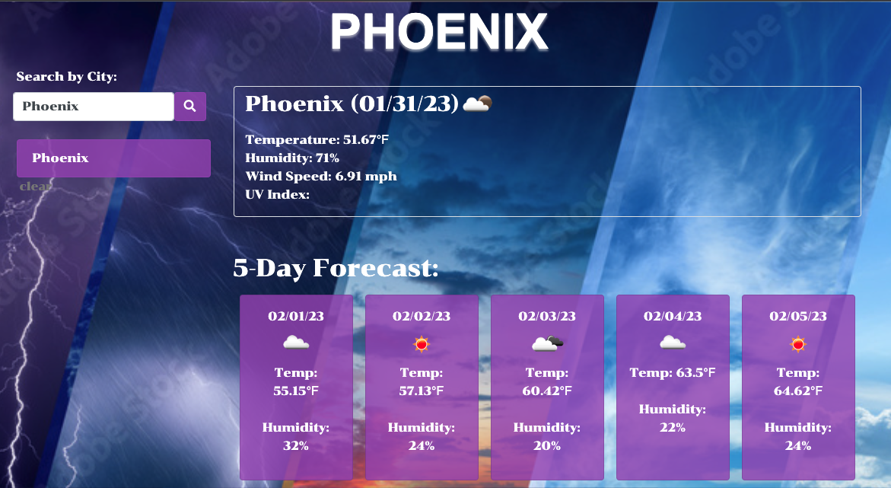
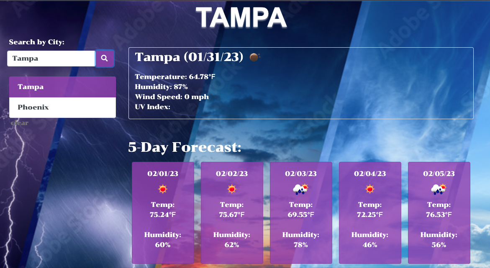
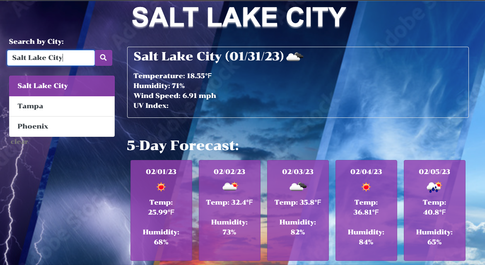
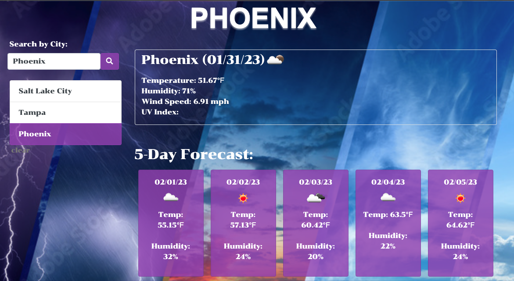
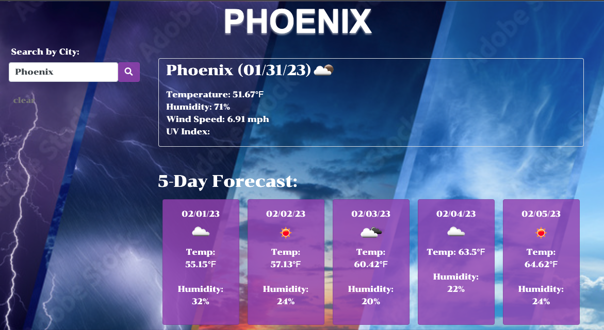

# Weather Dashboard

**[View Deployed Site](https://joshf2797.github.io/weatherDashboard/)**

## 5-Day weather app searched via city

---

 

## Table Of Contents

1. [Technology Used](#technology-used)
2. [User Story](#user-story)
3. [Demo](#oil-tracker-feature)
4. [Contact](#electric-vehicle-charge-locator)

---

 

## Technology Used:

- HTML
- CSS
- Bootstrap
- Javascript

---

 

## User Story

As the user of this web application, I want to be able to search for a cities current weather conditions as well as a 5-day forcast of that city. I want the cities I search for to be saved and displayed for easy access in case I want to search for the same city again. And I want to be able to clear the list of searched cities.

 

# Demo

Upon opening the page, the user will see this. Phoenix will be the default city searched.

 

When the user enters a new city in the search bar, the first city searched will be saved below the new city the user searches.

Each new search will be saved until the user clears the list

If the user wants to go back to a previously searched city, they can just click on the new of the city and it will search for the current weather status and new 5-day forcast

 

If the user wants to clear the list of searhed cities, they click on the clear button

  

# Contact

Gihub - https://github.com/joshf2797
